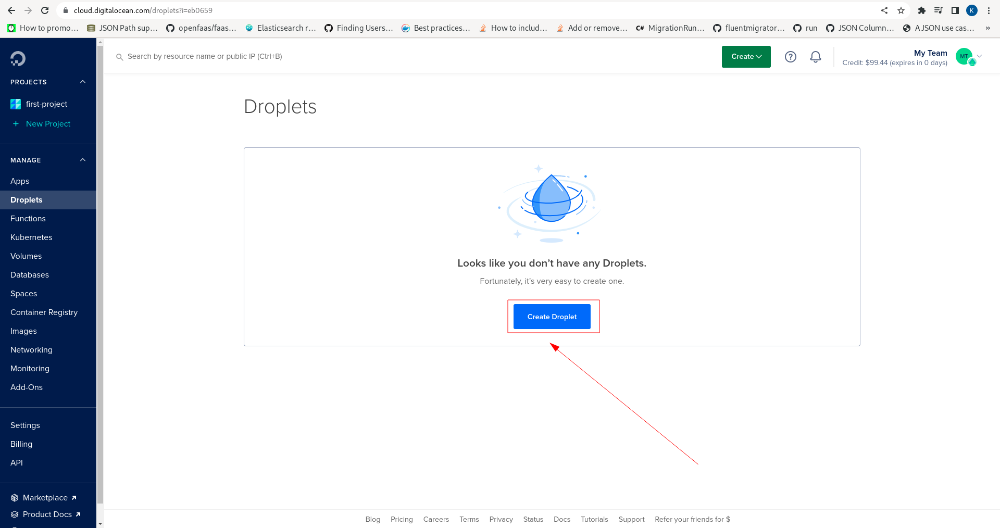
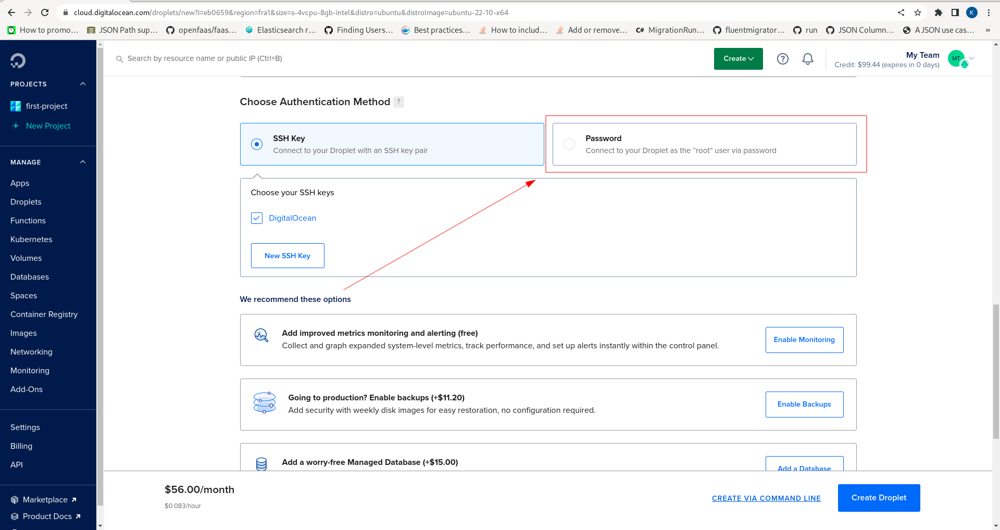
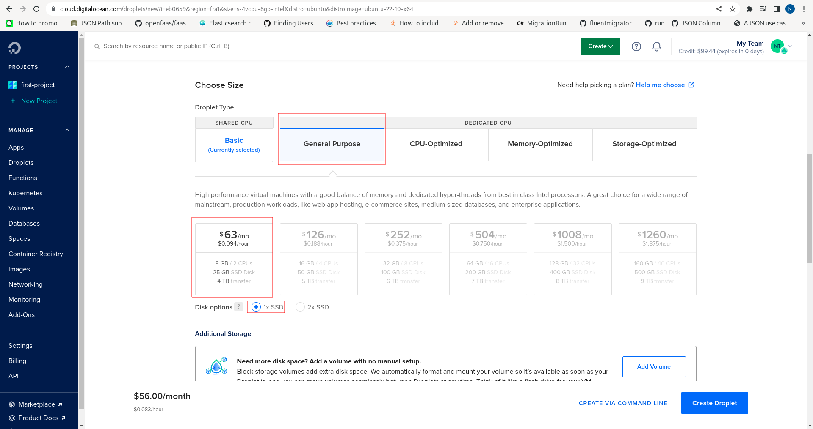
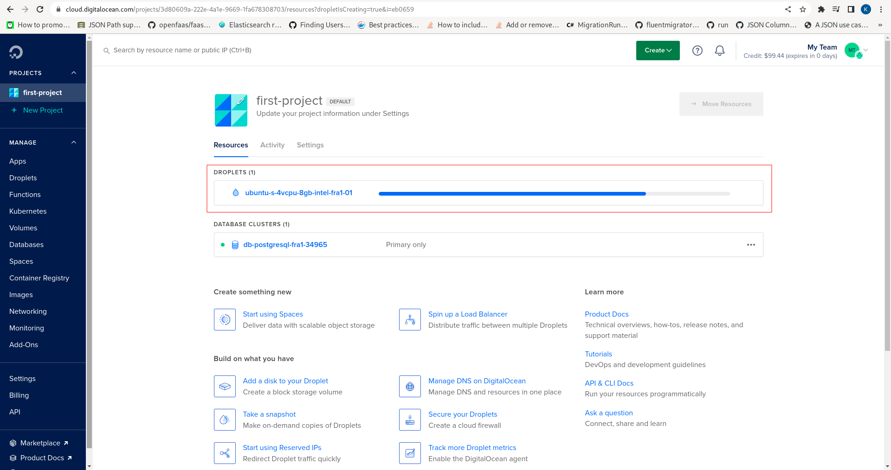
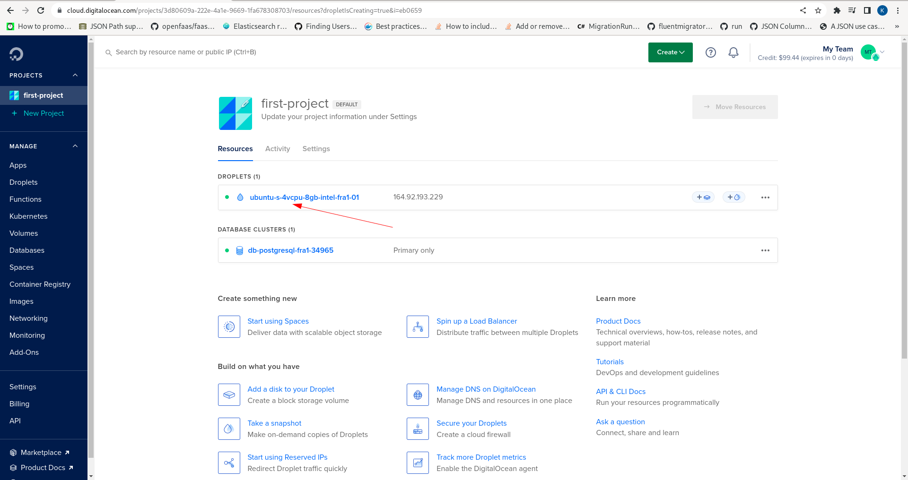

🚀Speed up implementation with hands-on, face-to-face [training](https://www.jube.io/training) from the developer.

# Creating Virtual Machine

A Droplet is a Virtual Machine and will contain the Jube software.  Having set up the database, locate the Droplet menu item:

Click on the Droplet menu item to expose the page to begin creation:

Note the prominent button Create Droplet:

Click the Create Droplet button:

Create a Droplet in a region geographically close, in this case Frankfurt:

Keeping the default Ubuntu operating system scroll down to set the credentials for the Droplet.

Credentials can take the form of either a password or SSH certificate.  Passwords are strongly discouraged,  however for illustrative purpose and approachability,  will be used in this example. It is well worth taking the time to generate an SSH key, but the concepts are outside the scope of this document, noting the DigitalOcean [guidance](https://docs.digitalocean.com/products/droplets/how-to/connect-with-ssh/) on the topic.  Scroll down to choose an an authentication method:

Note the radio buttons SSH key or password:

Click the password radio button: 

Create a very strong password and proceed to scroll down to size the Droplet:

Select for this example General Purpose, with the default entry level 2vCPU 8GB RAM,  with the default 1x SSD:

Note the Create Droplet button in the bottom left hand corner of the page:

Click the button to create the Droplet:

Waiting a moment for the Droplet to create before clicking on the link:

On clicking the link for the Droplet the landing page will be exposed which presents information about the Droplet:

Specifically the public IP address which will be used to expose the Jube software user interface and API endpoints:

Being a Linux Operating System it is possible to SSH for console,  however,  in this example the hosted console will be used.  Note the location of the Console link:

Click on the Console link to launch a session:

The Droplet has now been created and is read for prerequisites to be installed.

