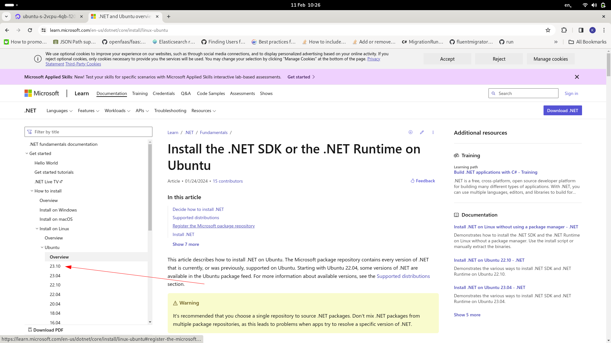
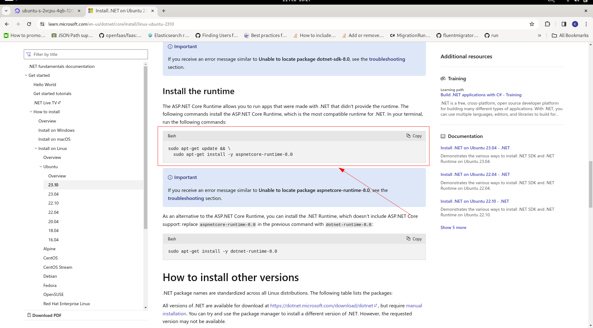

# Installing .Net 8 Runtime to Virtual Machine (aka Droplet)

The Droplet will be missing the .Net 8 Runtime by default, and it needs to be installed.  The packages are available from Microsoft as follows:

https://learn.microsoft.com/en-us/dotnet/core/install/linux-ubuntu

For Ubuntu 23.10 Linux for the purposes of this tutorial:

https://learn.microsoft.com/en-us/dotnet/core/install/linux-ubuntu-2310

Create a Droplet:


Navigate to cloud bash command line for the Droplet:


Scroll down the page and identify the package for the Linux distribution in use,  in this case  Ubuntu 23.10:



Click on the link to expose the command line statements to install:



The command to install can be extracted as follows:

```shell
sudo apt-get update && \
  sudo apt-get install -y aspnetcore-runtime-8.0
```

The shell command above is simply executed in the console via copy and paste:


Pressing enter will begin the process:


Until completion:

