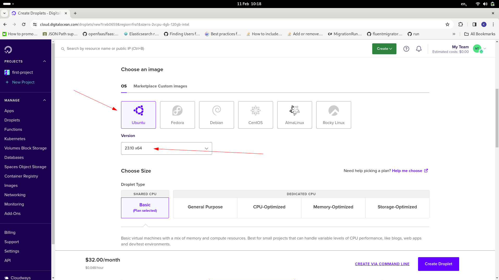
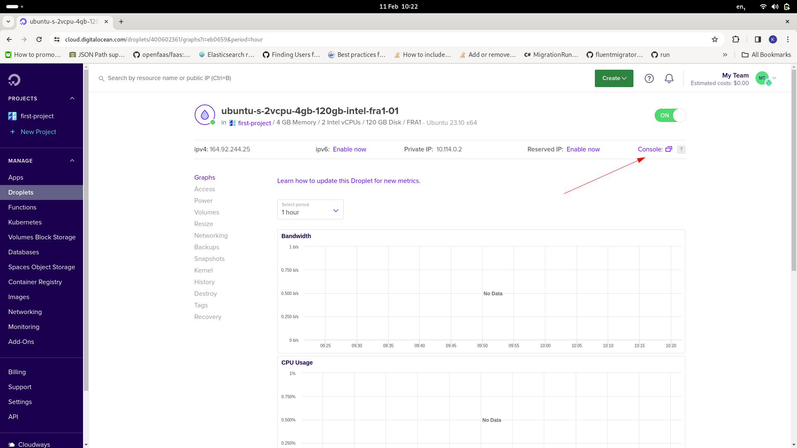
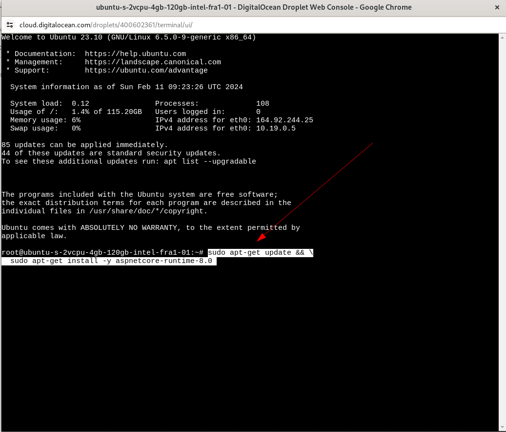
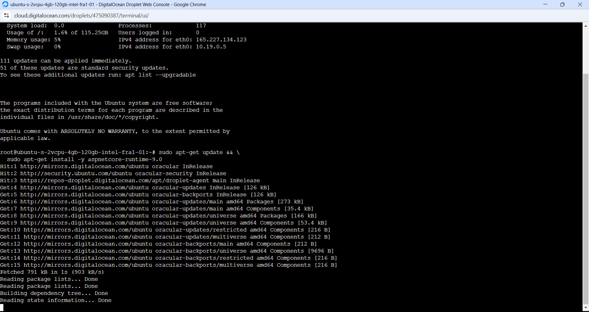
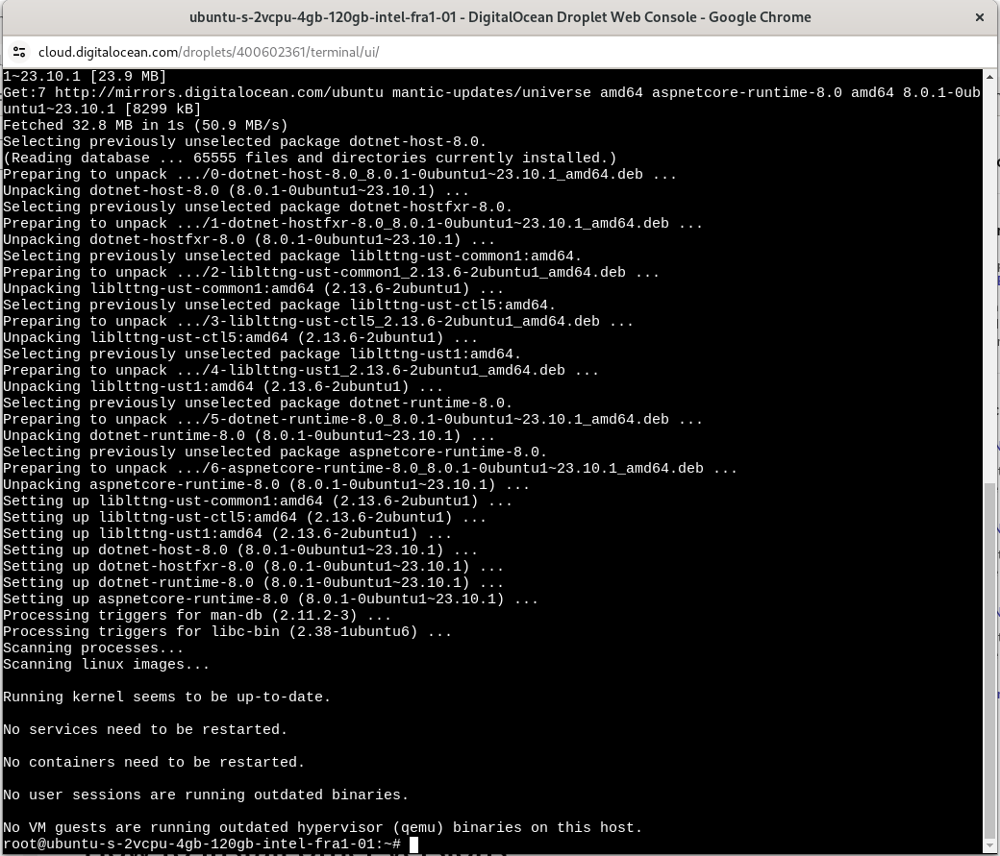

# Installing .Net 9 Runtime to Virtual Machine (aka Droplet)

The Droplet will be missing the .Net 9 Runtime by default, and it needs to be installed.  The packages are available from Microsoft as follows:

https://learn.microsoft.com/en-us/dotnet/core/install/linux-ubuntu

For Ubuntu 24.10 Linux for the purposes of this tutorial:

https://learn.microsoft.com/en-us/dotnet/core/install/linux-ubuntu-install?tabs=dotnet9&pivots=os-linux-ubuntu-2410

Create a Droplet:



Navigate to cloud bash command line for the Droplet:




The command to install can be extracted as follows:

```shell
sudo apt-get update && \
  sudo apt-get install -y aspnetcore-runtime-9.0
```

The shell command above is simply executed in the console via copy and paste:



Pressing enter will begin the process:



Until completion:

