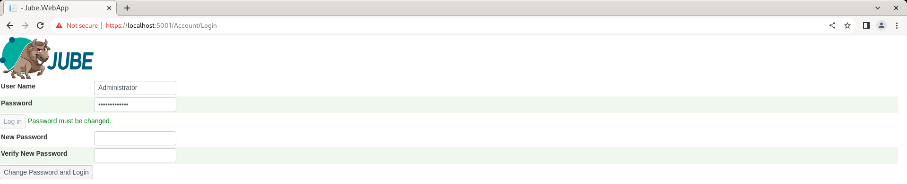

# Authentication
The login page needs to authenticate the user via a User Name and Password.


The default user name and password is:

User: Administrator

Password: Administrator

The default password is weak, however authentication will be blocked until a change of default password, thus it is only temporary.

Input the user name and password as specified above:


Click the Login button, which will assert that the password must be changed for reasons of expiry:



The password change must confirm to the following complexity rules:

* Length must be at least 8.
* Length must not exceed 16.
* Must contain at least one uppercase letter.
* Must contain at least one lowercase letter.
* Must contain at least one number.
* Must contain at least one of !? )*(. characters.

Complete the new password with appropriate complexity, and repeat for validation:


Click the Change Password and Login button which will proceed to change the password as part of the authentication process. Passwords are not stored in plain text and are hashed with the Argon2 algorithm (the computational expense does bring about slow experience during authentication however).

Upon successful authentication the user will be navigated to the home page of the user interface:


As a consequence of authentication via User Name and Password,  a JSON Web Token will exist in a cookie named "authenticate", and that same token will be returned in each http response from Jube in a HTTP header by the same name.  The cookie expires after 15 minutes of inactivity,  else,  given any activity it will be reissued for a further 15 minutes and being sent in both header and cookie.

Upon expiry of the token,  this is the session, authentication will need to be repeated.  Access to pages and API for the user interfaces will all start to generate HTTP 401 status and the User Interface will be unusable pending new authentication.

To logout navigate to the menu item Account >> Logout.


Clicking on the Logout menu item will proceed to remove the JSON Web Token cookie and thereafter navigate to the login page:


Authentication is a matter of obtaining a JSON Web Token and ensuring that this is available on HTTP request, in either a cookie named "authenticate", or in the customary location of HTTP header by the same name.

The nature of a JSON Web Token is that it does not have to be issued by the authentication components of Jube,  and upon knowledge of the JWT encryption key, a token can be created externally to the application.

The JSON web token encrypts using a Environment Variables as follows:

```text
JWTValidAudience=http://localhost:5001
JWTValidIssuer=http://localhost:5001
JWTKey=ExtraSuperDuperSecretKeyCreatedOnFirstStartup
```

| Value            | Description                                                                                                                                                           |
|------------------|-----------------------------------------------------------------------------------------------------------------------------------------------------------------------|
| JWTValidAudience | The server domain that is allowed the token.                                                                                                                          |
| JWTValidIssuer   | The server domain that issued the token.                                                                                                                              |
| JWTKey           | The encryption key for the JWT.  This key is created randomly on first startup of the Jube instance,  being stored in the Jube.environment file,  but can be changed. |

Notwithstanding the stateless architecture, the token contains a single claim type of Name (http://schemas.xmlsoap.org/ws/2005/05/identity/claims/name) which will contain the username (e.g. Administrator).

The User Name must correspond to an entry with the UserRegistry table:


```sql
select * from "UserRegistry"
```


The UserRegistry table is not intended to be administered directly, except to draw attention the the password not being stored in clear text. User interface interactions for the purpose of authorisation are explained in a separate section of this documentation.

Passwords are encrypted in an irreversible manner using the Argon2 hashing algorithm, alongside a salting value known only to the installation via Environment Variable. The salt value is stored in the Jube.environment file, having being randomly created on application first use:

```text
PasswordHashingKey=ExtraSuperDuperSecretKeyCreatedOnFirstStartup
```

It is worth noting that the key values set in Environment Variable must be common in each instance of Jube,  else password authentication and session maintenance will only work partially (thus not at all).