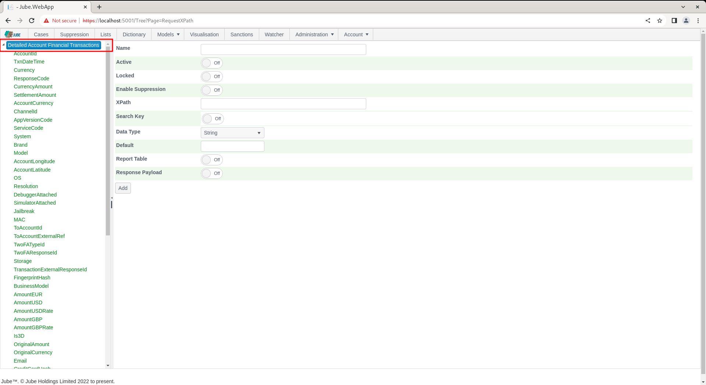
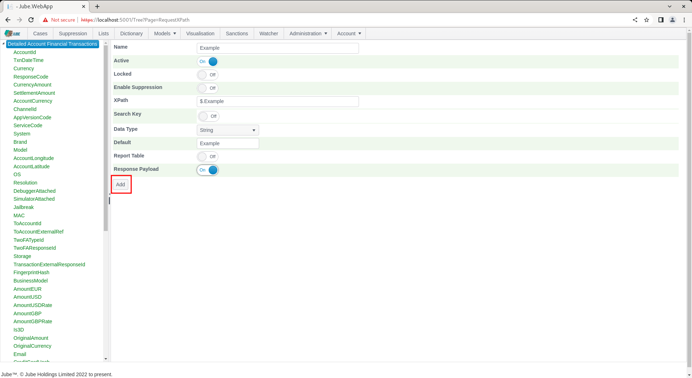
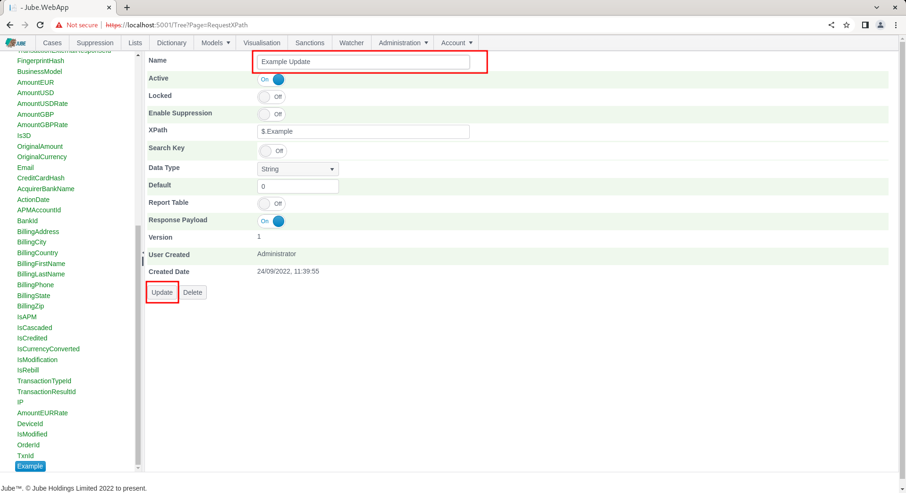
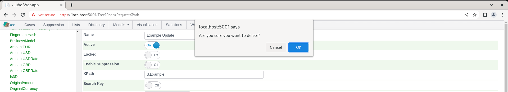

🚀Speed up implementation with hands-on, face-to-face [training](https://www.jube.io/training) from the developer.

# Child Objects

Child objects roll up to the Parent Objects and they are administered via a common user interface. In this example,  a Request XPath will be added to a Model (whereby the Model was used as an example of a Parent object beforehand).

Navigate Models >> References >> Request XPath:


To expand on the top most level to expose children,  simply click on the triangle icon next to the parent name:


On clicking the triangle icon,  a list of all children rolling up to the parent will be revealed:


To add a child object,  click on the parent entry in the tree for which to create the child,  exposing a blank form for the creation of a child object in the right hand pane:



Upon completing each field required of the child object in right hand panel,  clicking the Add button at the base of the form will commit the object:



Confirmation of the object having been committed will be returned care of the Add button disappearing and being replaced with an Update and Delete button,  alongside confirmation of the version and created date:


If the tree is expanded and scrolled down upon,  the new entry will be added to that tree,  otherwise the new entry can be viewed by expanding as aforementioned:


To update a child object,  start by expanding on the tree as described,  then click on the child entry to be edited:


Alter the values of the child object as required, then click the Update button to commit the changes:



Upon clicking Update, confirmation of a change to the child object is received by the Version being incremented by one:


Noting also,  in this example,  the name having been changed in the tree for selection:


As with update, to delete a child object,  start by expanding on the tree as described in the Navigate subsection of this section of the documentation,  then click on the child entry to be deleted.  Upon the child object being expanded into the right hand pane,  click on the Delete button to confirm that this child object requires deletion:


Upon clicking Delete,  a prompt will be displayed which will ask for confirmation of this delete:



Upon confirmation being given,  the delete will take place.  The entry on the left hand pane will be removed from the tree if it is still expanded,  whereas the right hand pane will write out further confirmation of the delete having taken place:


Each child object entry will have a Name field, which is a text string.  A description field appears on a more irregular basis but is a character string also.

For child objects there is a version system in place.  When a record is created for a child object, it is always accompanied by version data.

For child objects all update and deletes are done on a logical basis,  which means that they are marked as deleted in the database but still remain there for the purposes of audit.

When a child record is updated,  in actuality the record being updated is logically deleted and a new record with the incremented version number is created.  

For example, on inspection of the database table responsible for storage of Request XPath:

```sql
select "Name","Version","Deleted","InheritedId"
from "EntityAnalysisModelRequestXpath"
Order By "Id" desc
```

It can be seen that old versions of the entries are still present, with the InheritedId navigating to the record that came before in the version chain.

Some child records with complex relationships leave the existing record in place, instead keeping a record of the previous values in a version table, and include:

* Model TTL Counter Definitions.
* Case Workflow Status Definitions.
* Case Workflow Definitions.

The difference in versioning ensures that the Id be immutable,  as they may be referenced by other data.

For example,  on inspection of the versioning for Case Workflow Status Definitions:

```sql
select *
from "CaseWorkflowStatusVersion"
Order By "Id" desc
```

It can be seen that a full copy of the record was taken before it was updated.

Irrespective of the manner in which the history of the record is maintained, it should be noted that there is record for each update maintained in the database for the purposes of audit.