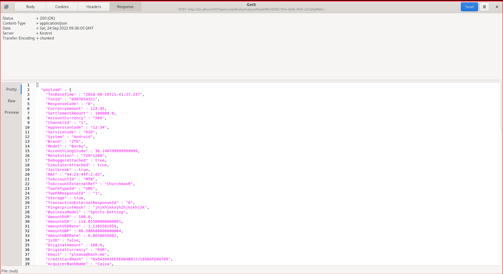

🚀Speed up implementation with hands-on, face-to-face [training](https://www.jube.io/training) from the developer.

# Response Payload

All Child Objects have the option to specify whether it should be returned in the response payload via HTTP or AMQP.  A Response Payload means that the content or value created will be returned to the HTTP response stream or AMQP payload,  otherwise excluded.  It is a means to reduce the amount of bandwidth that is used in extremely large throughput, as some hosting providers charge for outbound bandwidth:

Although JSON processing via HTTP or AMQP is outside the scope of this section of the documentation,  it may be stated that in this example,  the Currency only appears in the response payload because it has been switched as Response Payload:

Toggling of Response Payload for the Currency will, after synchronisation, remove the element from the response payload:

A like for like request via HTTP will now exclude transport of the Currency element in the response payload:

Irrespective of the Response Payload being selected,  the value will still be compiled into the Archive payload for database insertion.